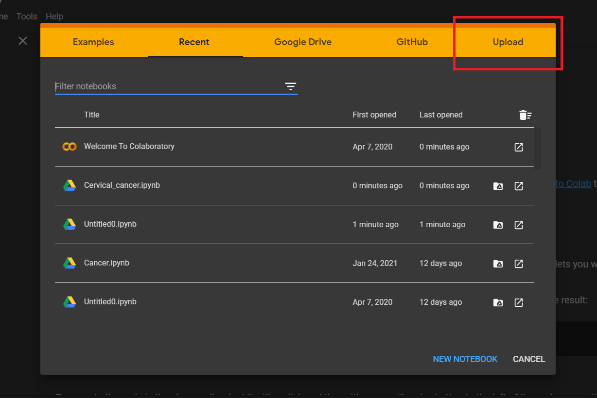
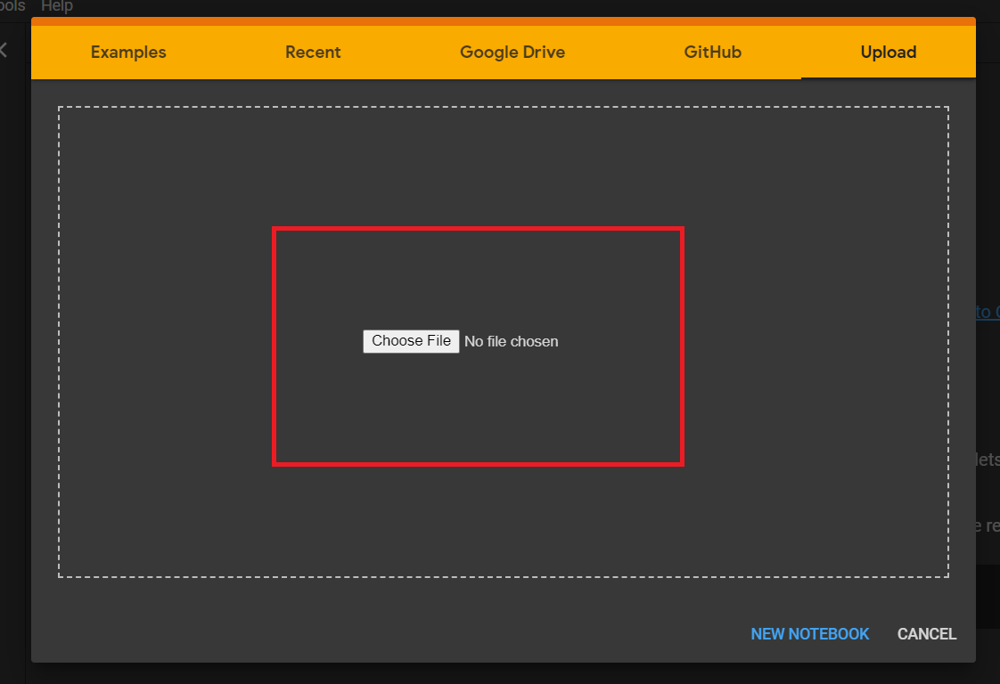
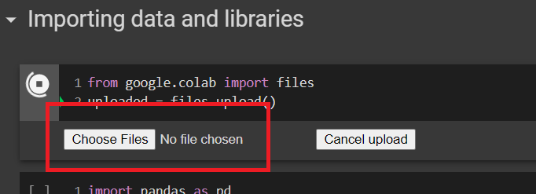

# RDBMS IA

Name: Vedant Mahadik

Class: SY COMPS B

Course: RDBMS

Faculty name: Vaibhav Vasani sir and Pradyna Bhangale ma'am

College name: K.J. Somaiya College of Engineering, Vidyavihar

## Topic: Machine Learning Applied to Cervical Cancer Data

- Given a dataset with 36 columns
  - 32 feature columns, 4 target columns
- Created a model using KNN to predict presence of cervical cancer for given feature values for a patient.

### To run the program:

> Note: To run the program we need Cervical_cancer.ipynb file (available in implementation folder) and cervical-cancer.csv (available in data folder) downloaded

#### Step 1: Go to [Google colab](https://colab.research.google.com/)

#### Step 2: Select upload

#### Step 3: Drag and drop Cervical_cancer.ipynb file

#### Step 4: Run cell number one and choose cervical-cancer.csv

#### Step 5: Run cells in sequential manner to get output

### Conclusion:

- The data was biased as the huge number of 0's in the dataset affected the output.
- Confusion matrix confirms the paper conclusion of data being biased

Thank you
